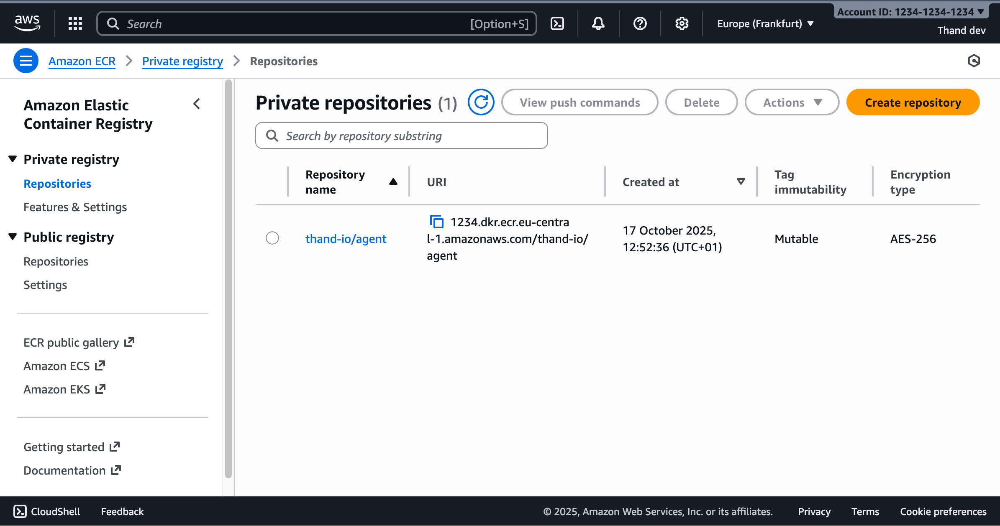
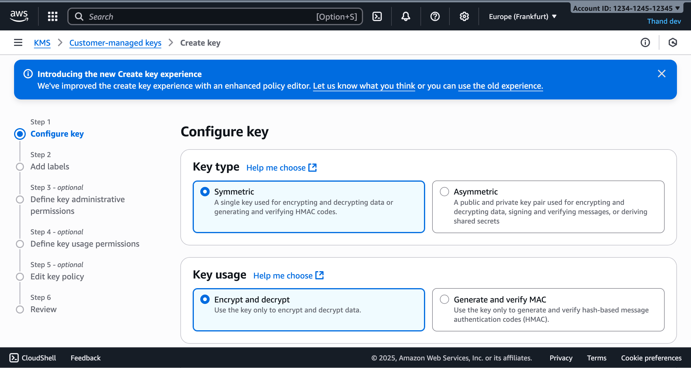
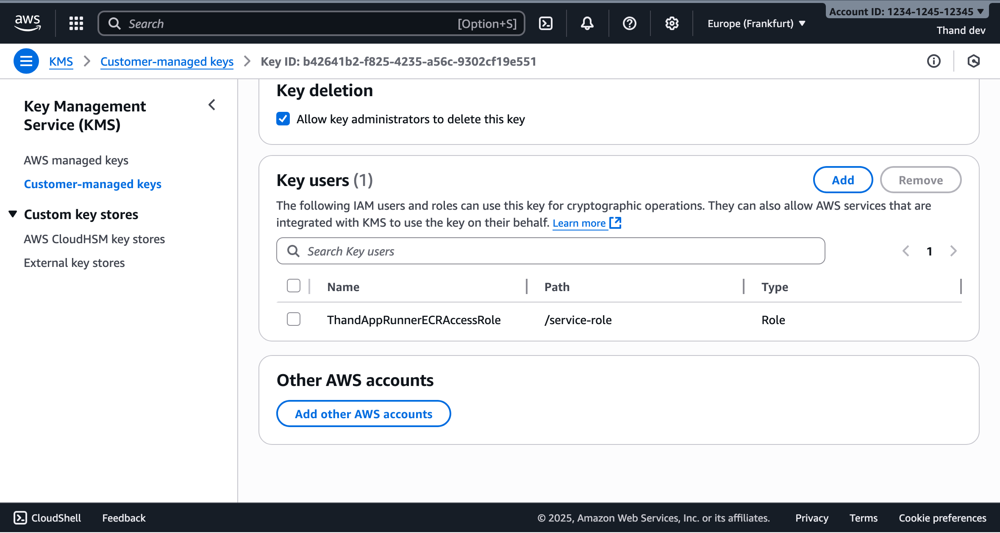
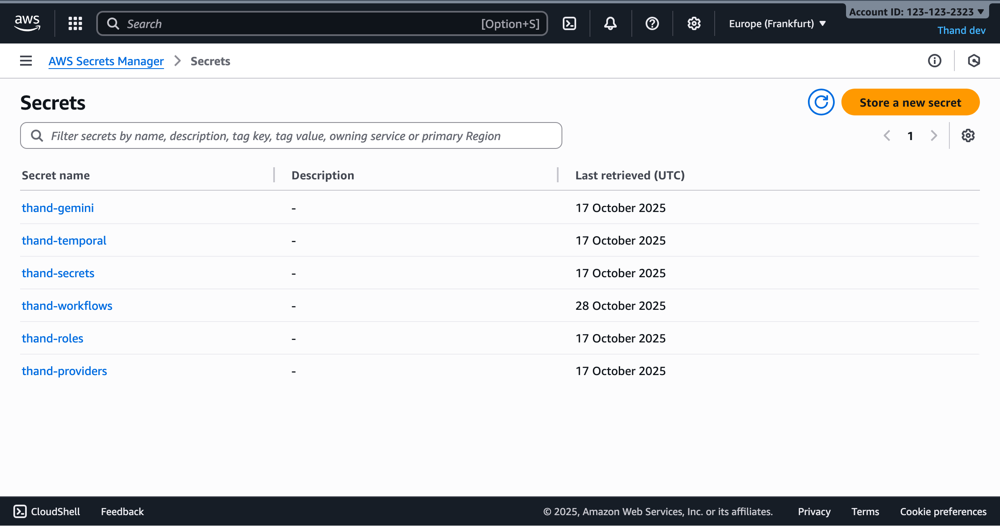
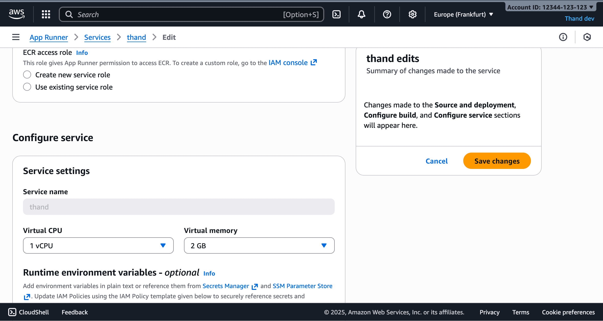
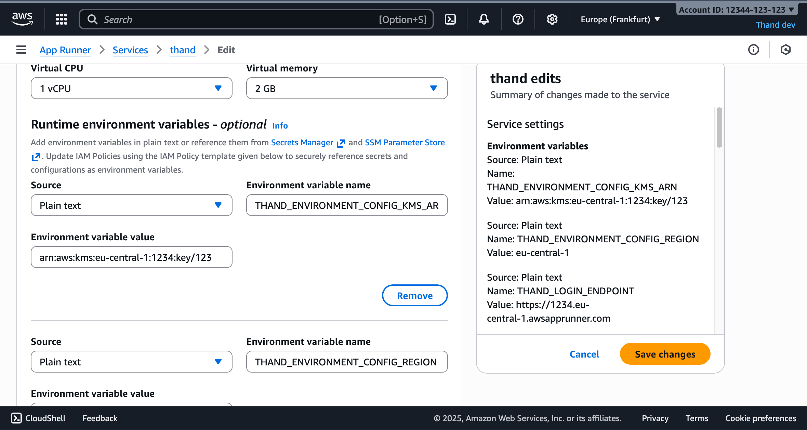
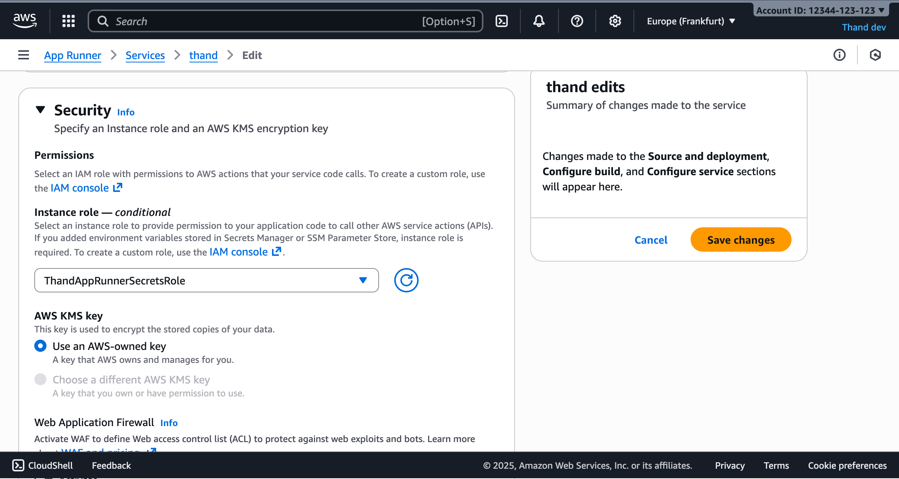

# App Runner Setup
{: .no_toc }

Complete guide to deploying Thand Agent on AWS App Runner with IAM integration.
{: .fs-6 .fw-300 }

## Table of contents
{: .no_toc .text-delta }

## Prerequisites

- An AWS account with billing enabled.
- Enable the following AWS services in your account:
  - AWS App Runner
  - Amazon Elastic Container Registry (ECR)
  - AWS Key Management Service (KMS)
  - AWS Secrets Manager
- AWS CLI installed and configured with appropriate permissions

### Elastic Container Registry Setup

Before deploying your App Runner service, you need to set up an ECR repository to store your Thand Agent Docker images.

- Navigate to the [Amazon ECR console](https://console.aws.amazon.com/ecr/) in your AWS account.
- Under **Private repositories**, click on "Create repository".
- Provide a namespace name and repo name for your repository (e.g., `thand-io/agent`). To mirror the official Thand GHCR repository, you can use `thand-io/agent`.
- Configure scan settings as desired (this may incur additional costs).
- Click "Create repository".

Once created, you'll see the repository details page. Note the URI of your repository - you'll need this later. It should look like:
`AWS_ACCOUNT_ID.dkr.ecr.REGION.amazonaws.com/thand-io/agent`



As AWS ECR does not proxy images from external registries, you will need to push the Thand Agent image from GHCR to your ECR repository.

```bash
# First pull the thand agent image from GHCR
docker pull ghcr.io/thand-io/agent:latest

# Use the View push commands button in the ECR console to get the login command for your registry
aws ecr get-login-password --region eu-central-1 | docker login --username AWS --password-stdin AWS_ACCOUNT_ID.dkr.ecr.REGION.amazonaws.com

# Tag the image for your ECR repository
docker tag ghcr.io/thand-io/agent:latest AWS_ACCOUNT_ID.dkr.ecr.REGION.amazonaws.com/thand-io/agent:latest

# Push the image to your ECR repository
docker push AWS_ACCOUNT_ID.dkr.ecr.REGION.amazonaws.com/thand-io/agent:latest
```

### Setup App Runner Service

- Navigate to the [AWS App Runner console](https://console.aws.amazon.com/apprunner/) in your AWS account.
- Click on "Create service".
- Choose "Container registry" as the source.
- For "Container image URI", enter your ECR repository URI followed by the tag (e.g., `AWS_ACCOUNT_ID.dkr.ecr.REGION.amazonaws.com/thand-io/agent:latest`).
- Configure deployment settings:
  - Deployment trigger: "Manual" (you can change this to automatic later)
  - ECR access role: Create a new service role or use an existing one with ECR access
- Click "Next".

{: .note}
This will deploy your service and provide you with a URL to access it. Nothing has been configured yet. However, at this point it should be running. You will get unauthorized 
errors until you configure the agent with proper authentication.

### Enabling Encryption (AWS KMS)

To enable encryption with AWS KMS, you need to create a KMS key and configure the appropriate environment variables:

- Navigate to the [AWS KMS console](https://console.aws.amazon.com/kms/) in your AWS account.
- Click on "Create key".
- Choose "Symmetric" as the key type.
- Choose "Encrypt and decrypt" as the key usage.
- Choose "KMS" as the key material origin.
- Click "Next".



Configure the key details:
- Add an alias for your key (e.g., `thand-agent`)
- Add a description (e.g., "Encryption key for Thand Agent")
- Click "Next".

Define key administrative permissions:
- Select the IAM users and roles that can administer this key
- Click "Next".

Define key usage permissions:
- Select the IAM users and roles that can use this key for cryptographic operations
- Make sure to include the App Runner instance role you created earlier
- Click "Next".



Review and create the key. **Note the key ARN - you'll need this for configuration.**

### Enabling Vault (AWS Secrets Manager)

Many of the providers supported by Thand that require API keys or secrets can be configured to use AWS Secrets Manager to store and retrieve these secrets securely.

This can either be done by configuring the provider to use Secrets Manager directly, or by configuring Thand to use Secrets Manager as its secret backend.

In this example, we will configure Thand to use Secrets Manager as its secret backend. We will create three secrets for our roles, providers, and workflows.

A default provider for AWS using the IAM role attached to the App Runner service would look something like this:

```yaml
providers:
  aws:
    name: AWS Default
    description: Default AWS provider using IAM role
    provider: aws
    enabled: true
    config:
      region: us-east-1
```

Create the secrets:

- Navigate to the [AWS Secrets Manager console](https://console.aws.amazon.com/secretsmanager/) in your AWS account.
- Click on "Store a new secret".
- Choose "Other type of secret".
- Select "Plaintext" tab.
- In the text area, provide your entire [provider](../../configuration/providers/) configuration in YAML or JSON format.
- Click "Next".

Configure secret details:
- Secret name: `thand-providers`
- Description: "Thand Agent providers configuration"
- Click "Next".

Configure rotation (optional):
- For configuration secrets, rotation is typically not needed
- Click "Next".

Review and store the secret.

Repeat the above steps to create two more secrets:
- `thand-roles` - containing your [roles configuration](../../configuration/roles/)
- `thand-workflows` - containing your [workflows configuration](../../configuration/workflows/)

Documentation for configuring providers, roles and workflows can be found in the [Configuration](../../configuration/) section.



You might also need to store other secrets depending on your provider configurations. Or other environment specific secrets you want to manage via Secrets Manager. Unfortunately, you will need to create a secret per environment variable.

Otherwise, you can provide your configuration via a mounted volume or other methods as described in the [Configuration](../../configuration/) section.

## IAM Role for App Runner

In order for your Thand Agent running on App Runner to access KMS and Secrets Manager, you need to create an IAM role with the appropriate permissions and attach it to your App Runner service.

- Navigate to the [IAM console](https://console.aws.amazon.com/iam/) in your AWS account.
- Navigate to Roles and click "Create role".
- Choose **Custom trust policy** and use the following trust relationship:

```json
{
    "Version": "2012-10-17",
    "Statement": [
        {
            "Effect": "Allow",
            "Principal": {
                "Service": "tasks.apprunner.amazonaws.com"
            },
            "Action": "sts:AssumeRole"
        }
    ]
}
```

- Click "Next".
- Next add the following pre-defined permissions policies. Additionally add any other policies needed for your provider configurations. You can also define your own more restrictive policies as needed. However, for simplicity we will use pre-defined policies here:
  - `SecretsManagerReadWrite`
  - `AmazonSSMFullAccess`
  - `AmazonS3ReadOnlyAccess`
  - `AWSKeyManagementServicePowerUser`
  - `AWSSSOMasterAccountAdministrator` - if you plan to manage AWS SSO via Thand.
  - `IAMFullAccess` - if you plan to manage IAM roles via Thand.
- Lastly, provide a role name (e.g., `ThandAppRunnerIamRole`) and description.
- Click "Create role".

## Configure Thand App Runner Service

Now we've deployed all the necessary AWS resources, we need to configure our Thand Agent App Runner service to make use of them.

- Navigate to the AWS App Runner console. [Aws App Runner Console](https://console.aws.amazon.com/apprunner/)
- Select your Thand Agent service.
- Click on "Configuration" tab.
- Click "Edit" in the "Configure service" section.

First, we need to update the instance resources to ensure the service has enough memory:
- Under "Instance configuration", change the memory to at least 4 GB (2 vCPU, 4 GB memory recommended)



Next, Under **Runtime environment variables**, add the following:

| Variable Name                     | Description                                                                                   | Example Value                                      |
|----------------------------------|-----------------------------------------------------------------------------------------------|----------------------------------------------------|
`THAND_ENVIRONMENT_CONFIG_KMS_ARN` | Your KMS key ARN or alias                                                                | `arn:aws:kms:REGION:ACCOUNT_ID:key/KEY_ID`        |
`THAND_ENVIRONMENT_CONFIG_REGION` | Your AWS region                                                                               | `us-east-1`                                       |
`THAND_LOGIN_ENDPOINT`            | The endpoint for your deployed Thand agent                                                   | `https://abc123.us-east-1.awsapprunner.com`      |
`THAND_PROVIDERS_VAULT`           | The name of the Secrets Manager secret containing your providers configuration               | `thand-providers`                                  |
`THAND_ROLES_VAULT`               | The name of the Secrets Manager secret containing your roles configuration                   | `thand-roles`                                     |
`THAND_WORKFLOWS_VAULT`           | The name of the Secrets Manager secret containing your workflows configuration               | `thand-workflows`                                 |
`THAND_ENVIRONMENT_PLATFORM`     | The environment platform for the Thand agent                                                 | `aws`                                             |

Your final environment variables should look something like this:



Lastly, under the **Security** section, ensure that the IAM role you created earlier (`ThandAppRunnerIamRole`) is selected as the instance role.



Click "Next" and then "Create & deploy" to create your App Runner service.

## Custom domain (Optional)

If you want to use a custom domain for your Thand Agent App Runner service, you can set it up as follows:

- Navigate to the AWS App Runner console.
- Select your Thand Agent service.
- Click on the "Configuration" tab.
- Under the "Custom domain" section, click "Add custom domain".
- Enter your custom domain name (e.g., `thand.example.com`).
- Follow the instructions to verify domain ownership and configure DNS settings.

## Verification

Once the new deployment is complete, you can verify that the Thand Agent is correctly configured by accessing the App Runner service URL in your web browser.

You should see the Thand Agent interface indicating successful deployment.

You can then log in via the Thand CLI tool using the `--login-server` flag pointing to your App Runner service URL:

```bash
thand login --login-server https://abc123.us-east-1.awsapprunner.com
```

You can then query what roles you have access to:

```bash
thand roles --login-server https://abc123.us-east-1.awsapprunner.com
```

## Troubleshooting

If you encounter any issues, you can check the logs of your App Runner service:

- Navigate to the AWS App Runner console.
- Select your Thand Agent service.
- Click on the "Logs" tab to view the application logs.
- Use CloudWatch Logs for more detailed log analysis if needed.

Common issues:
- **Permission errors**: Ensure the instance role has the correct permissions for KMS and Secrets Manager
- **Configuration errors**: Verify that the secret names and KMS key references are correct
- **Network connectivity**: Check that your App Runner service can access AWS services (this should work by default)

## Security Considerations

- Use least-privilege IAM policies
- Enable VPC connector if you need to access private resources
- Consider using AWS WAF for additional protection
- Regularly rotate secrets and review access logs
- Enable CloudTrail for audit logging
