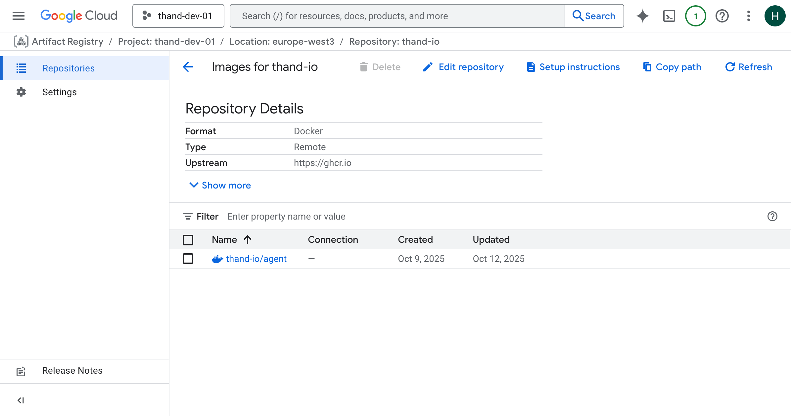
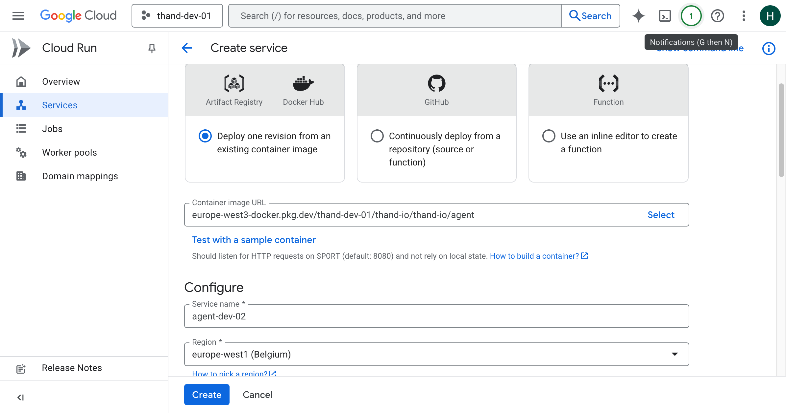
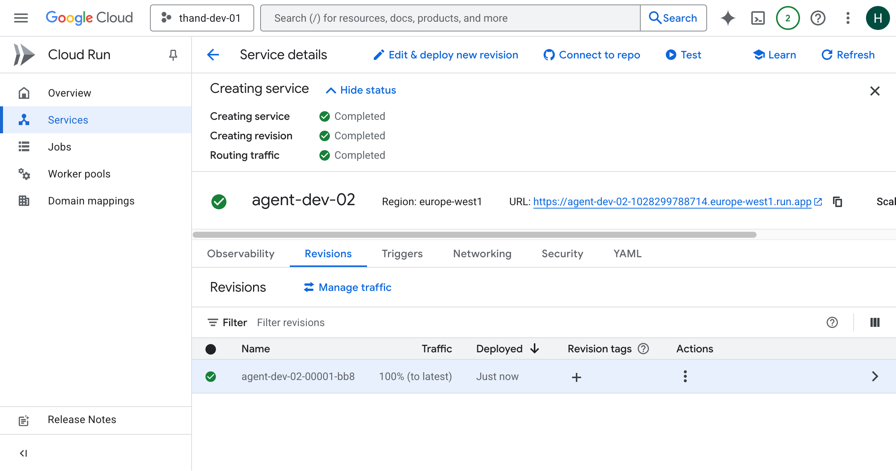
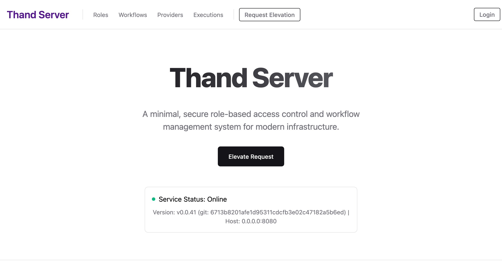
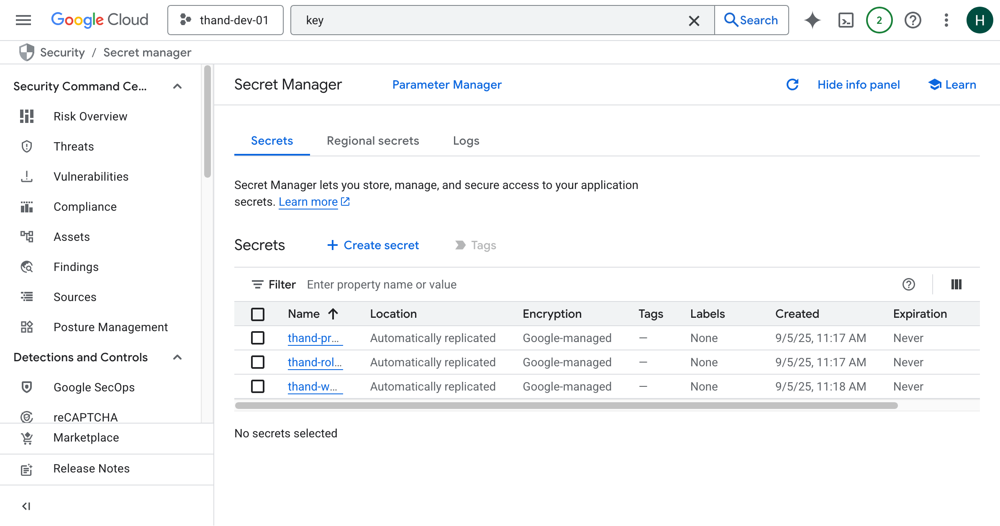
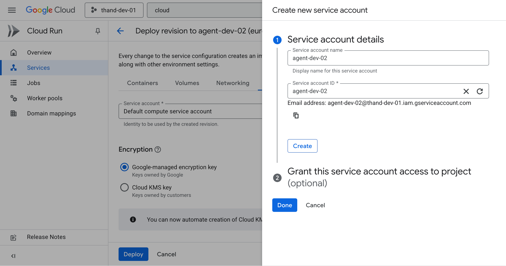
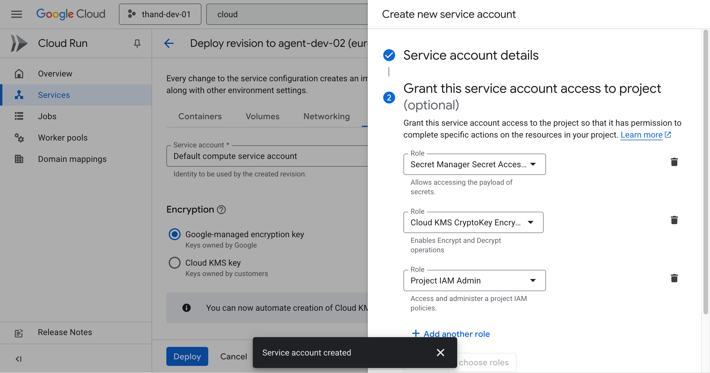
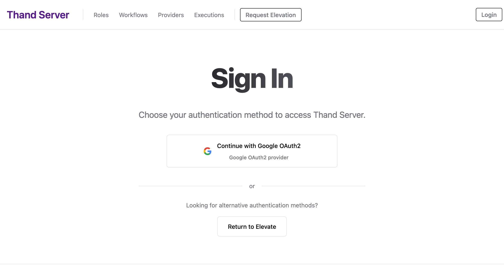

# Cloud Run Setup
{: .no_toc }

Complete guide to deploying Thand Agent on Google Cloud Run with IAM integration.
{: .fs-6 .fw-300 }

## Table of contents
{: .no_toc .text-delta }

## Prerequisites

- A Google Cloud Platform account with billing enabled.
- Enable the following cloud APIs in your GCP project:
  - Cloud Run API
  - Artifact Registry API
  - Cloud Key Management Service (KMS) API (This service can take a while to enable)
  - Secret Manager API


### Artifact Repository Setup

Before deploying your Cloud Run service, you need to set up an Artifact Repository to store your Thand Agent Docker images.

- Navigate to the [Artifact Registry page](https://console.cloud.google.com/artifacts) in the GCP Console.

- Click on "Create Repository".
- Provide a name for your repository (e.g., `thand-io`).
- Choose "Docker" as the format.
- Choose "Remote" as the repository mode.
- Set the Remote repository source to "https://ghcr.io".
- Set the Remote repository authentication mode to "Unauthenticated".
- Select a location (region) for your repository.
- Choose your option for vulnerability scanning (this will incur costs).
- Click "Create".

You will then be created to the newly created repository page. Click "Copy path" you will need this later. You should see something like this:



### Setup Cloud Run Service

- Navigate to the [Cloud Run page](https://console.cloud.google.com/run) in the GCP Console.
- Click on "Deploy container".
- In the container image URL field, copy the path to your Artifact Repository followed by `/thand-io/agent` and the desired tag (e.g., `latest`), resulting in a full path like `LOCATION-docker.pkg.dev/PROJECT_ID/REPOSITORY_NAME/thand-io/agent:latest`.



- Enter a service name (e.g., `thand-agent`).
- Choose the desired region for your service.
- Under "Authentication", select "Allow unauthenticated invocations" if you want your service to be publicly accessible.
- Click "Create" to deploy your Cloud Run service.



{: .note}
This will deploy your service and provide you with a URL to access it. Nothing has been configured yet. However, at this point it should be running. You will get unauthorized 
errors until you configure the agent with proper authentication.



## Configuring Thand Agent on Cloud Run

By default Thand will make use of its internal services for encryption etc. However, you can configure Thand to use external services for these features.

### Enabling Encryption (Key Management Service)

To enable encryption with an external service, you need to configure the following environment variables in your Cloud Run service:

- Navigate to the [Cloud KMS page](https://console.cloud.google.com/security/kms/keyrings) in the GCP Console.
- Click on "Create Key Ring".
- Provide a name for your key ring (e.g., `thand-keyring`).
- Select a location (region) for your key ring. E.g., `global`.
- Click "Create".

Once created you'll be taken to the key ring page. 

- Click on "Create Key".
- Provide a name for your key (e.g., `thand-key`).
- Key material set to "Generated".
- Choose "Symmetric" as the key type. This allows for encryption and decryption.
- Choose the desired protection level (e.g., "Software" or "HSM"). HSM will incur additional costs.
- Click "Create".


### Enabling Vault (Secret Manager API)

Many of the providers supported by Thand that require API keys or secrets can be configured to use GCP Secret Manager to store and retrieve these secrets securely.

This can either be done by configuring the provider to use Secret Manager directly, or by configuring Thand to use Secret Manager as its secret backend.

In this example and to keep things simple, we will configure Thand to use Secret Manager as its secret backend. We will create three secret stores for our roles, providers and workflows.

A default provider for google cloud using the service account attached to the Cloud Run service would look something like this:

```yaml
providers:
  gcp:
    name: GCP Default
    description: Default GCP provider using service account
    provider: gcp
    enabled: true
    config:
      project_id: YOUR_PROJECT_ID
```

- Navigate to the [Secret Manager page](https://console.cloud.google.com/security/secret-manager) in the GCP Console.
- Click on "Create Secret".
- Provide a name for your secret (e.g., `thand-providers`).
- In the "Secret value" field, provide your entire [provider](../../configuration/providers/) configuration. Use either YAML or JSON format and upload it via the "Upload file" option.
- Click "Create Secret".

Repeat the above steps to create two more secrets:
- `thand-roles` - containing your [roles configuration](../../configuration/roles/)
- `thand-workflows` - containing your [workflows configuration](../../configuration/workflows/)

Documentation for configuring providers, roles and workflows can be found in the [Configuration](../../configuration/) section.

- **Providers** - [Providers Configuration](../../configuration/providers/)
- **Roles** - [Roles Configuration](../../configuration/roles/)
- **Workflows** - [Workflows Configuration](../../configuration/workflows/)



You can also simply mount a volume with the contents of your configuration files if you prefer not to use Secret Manager.

## Configure Thand Cloud Run

Now that you have set up the necessary services, you need to configure your Cloud Run service to use them.

### Setup Service Account

Depending on how you set up your Cloud Run service, a default service account may have been created for it. You can use this service account or create a new one with the necessary permissions.

### Create a Service Account as Docker container

Under the service details section of your Cloud Run service, click on the **Edit and Deploy New Revision** button.

In the **Security** section, scroll down to the **Service account** dropdown. Select create a new service account **Create new service account**.

Provide a name for your service account (e.g., `thand-agent`).



You'll then need to configure the necessary roles for this service account. Click on the **+ Add Another Role** button and add the following roles:
- Secret Manager Secret Accessor
- Cloud KMS CryptoKey Encrypter/Decrypter
- Project IAM Admin (if you plan to manage IAM roles via Thand)



### Cloud Run as Github Repository

When your Cloud Run service is created from a **GitHub repository**, a default service account is created for it. You can use this service account or create a new one with the necessary permissions.

- Navigate to the [IAM & Admin page](https://console.cloud.google.com/iam-admin/iam) in the GCP Console.
- Locate the service account associated with your Cloud Run service (it will typically be named `CLOUD_RUN_NAME@PROJECT_ID.iam.gserviceaccount.com`).
- Click on the pencil icon to edit the service account's permissions.
- Click on "Add Another Role" and add the following roles:
  - Secret Manager Secret Accessor
  - Cloud KMS CryptoKey Encrypter/Decrypter
  - Project IAM Admin (if you plan to manage IAM roles via Thand) 
- Click "Save".

### Setting Environment Variables

Now that everything is set up, you need to configure the necessary environment variables in your Cloud Run service.

This will let the agent know where to find the KMS and Secret Manager resources.

- Navigate to the Cloud Run Functions page in the GCP Console.
- Click **Edit & Deploy New Revision** for your Thand Agent service.
- Under **Containers**, scroll down to the **Environment Variables** section.
- Here you'll need to add the following environment variables:

| Variable Name                     | Description                                                                                   | Example Value                                      |
|----------------------------------|-----------------------------------------------------------------------------------------------|----------------------------------------------------|
| `THAND_ENVIRONMENT_PLATFORM`             | The environment platform for the Thand agent. This will override detection at startup.                                                 | `gcp`                                             |
| `THAND_PROVIDERS_VAULT`       | The name of the Secret Manager secret containing your providers configuration.                | `thand-providers`                                  |
| `THAND_ROLES_VAULT`   | The name of the Secret Manager secret containing your roles configuration.                | `thand-roles`                              |
| `THAND_WORKFLOWS_VAULT`   | The name of the Secret Manager secret containing your workflows configuration.                | `thand-workflows`                              |
| `THAND_ENVIRONMENT_CONFIG_PROJECT_ID` | Your Google Cloud project ID.                                        | `thand-1234` |
| `THAND_ENVIRONMENT_CONFIG_KEY_RING` | Your Google Cloud key ring name.                                          | `thand-prod`                             |
| `THAND_ENVIRONMENT_CONFIG_KEY_NAME` | Your Google Cloud key name.                                           | `thand-prod`                                           |
| `THAND_LOGIN_ENDPOINT` | The endpoint for your deployed Thand agent. Used either the cloud run endpoint or your own custom domain configured separately.                                     | `https://agent-dev-01-1234.europe-west1.run.app`                            |

- After adding the environment variables, click "Deploy" to apply the changes.

## Verification

Once the new revision is deployed, you can verify that the Thand Agent is correctly configured by accessing the Cloud Run service URL in your web browser.

You should see something like this:



You'll then be able to login in via the thand cli tool using the `--login-server` flag pointing to your Cloud Run service URL.

```bash
thand login --login-server https://agent-dev-01-1234.europe-west1.run.app
```

You can then query what roles you have access to:

```bash
thand roles --login-server https://agent-dev-01-1234.europe-west1.run.app
```

## Troubleshooting

If you encounter any issues, you can check the logs of your Cloud Run service:

- Navigate to the [Cloud Run page](https://console.cloud.google.com/run) in the GCP Console.
- Click on your Thand Agent service.
- Click on the "Logs" tab to view the logs.


